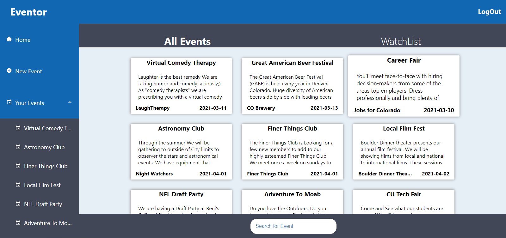
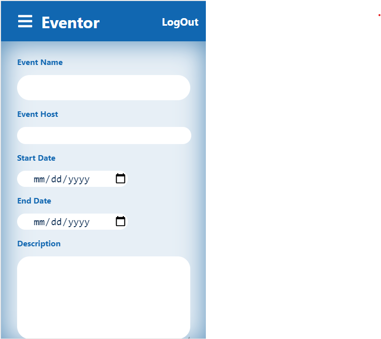
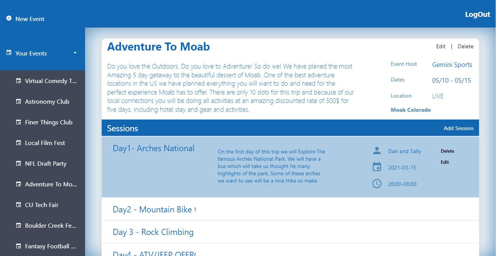

## Table of Contents

* [Description](#description)
* [Links](#links)
* [Screenshots](#screenshots)
* [Installation](#installation)
* [Usage](#usage)
* [Technologies Used](#technologies)
* [Tests](#tests)
* [Collaborators](#collaborators)
* [Contributing](#contributing)
* [Questions](#questions)

## Description

Eventor is an event orgaization platform. Create and Event that includes mulitple sessions. See events other users have created and add to your watchlist

FrontEND HOSTED ON HEROKU SERVER
[FrontEnd github REPO ](https://github.com/benimahat1291/Eventor)

This application is powered by the MERN stack, using mongoDB to host the Back-end and React.js for the front-end framework. Fully Mobile Responisve so you can use it on your Phone

## Links

[See the Deployed Eventor on Heroku](https://bit.ly/eventoreventplanner)

[FrontEnd github REPO ](https://github.com/benimahat1291/Eventor)

## Screenshots

## Installation Instructions

run "npm i" in the root file of the application. 
run "npm start" to start development server on your localhost

## Usage

This application is intended to be used to facilitate the creation and management of events, conferences and seminars. Simply open the application on your desired web browser, log in and you are ready to go.  

After logging in, the app will take you to the all events page that houses events created on this app. Here you can see your basic information and a list of the conferences you created and those conferences you are attending. Clicking the "+" button will allow you to create a new conference. The "details" button allows you to see the the details for that conference, including sessions and speakers.    

The home page allows you to search existing conferences and to your watch list.

## Technologies Used

MongoDB, Express.js, React, Node.js, auth0.com, particle.js

## Collaborators

This app was built by Beni Mahat

## Contributing

I believe code is never finished, welcome your contributions to enhance the applications functionality. Please adhere to the Code of Conduct for the Contributer Covenant, version 2.0, at https://www.contributor-covenant.org/version/2/0/code_of_conduct.html.

## Questions

If you have further projects and questions, you can find me on Github: [GITHUB](https://github.com/benimahat1291). 
please visit my portfolio to find contact information: [BENI MAHAT](https://benimahat1291.github.io/Portfolio_v2/#/). 
